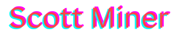

<!-- Static Name Image with Glitch Effects -->

  

<!-- Typing SVG -->
# 👋 About Me

  

<!-- Spotify Now Playing Widget -->
# 🎧 Music I'm Listening To

  

<!-- Last.fm Recently Played -->

  

# 🛠️ Tools & Languages

  
  
  
  
  
  
  
  
  

  
  
  
  

  
  
  
  
  

  

# 🏆 GitHub Trophies
<!-- GitHub Trophies (Excluding 'Reviews') -->

  

# 📊 GitHub Stats
<!-- GitHub Stats -->

  
  

<!-- Snake Game (GitHub Contribution Graph) -->

  

