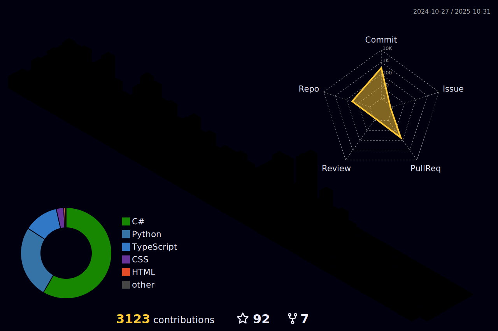

<!-- Static Name Image with Glitch Effects -->

  

<!-- Typing SVG -->
# 👋 About Me

  
   <!-- Snake Game (GitHub Contribution Graph) -->
  

<!-- 3D Contribution Graph -->

  

# 📜 Latest Blog Posts

[Subscribe via RSS](https://bloggie-efhpg4bbcsc0b2bz.westus2-01.azurewebsites.net/feed)

<!-- This marker is used by a GitHub Actions workflow to automatically inject the latest blog posts. -->
<!-- BLOG-POST-LIST:START -->
- [Setting Up Your ASP.NET Core Development Environment: A Beginner’s Guide](https://bloggie-efhpg4bbcsc0b2bz.westus2-01.azurewebsites.net/Blogs?urlHandle=setting-up-aspnet-core-development-environment)
- [Comparing ASP.NET Web Forms, ASP.NET MVC, and ASP.NET Core](https://bloggie-efhpg4bbcsc0b2bz.westus2-01.azurewebsites.net/Blogs?urlHandle=comparing-aspnet-web-forms-aspnet-mvc-aspnet-core)
- [Introduction to ASP.NET Core: A Modern, Cross-Platform Web Framework](https://bloggie-efhpg4bbcsc0b2bz.westus2-01.azurewebsites.net/Blogs?urlHandle=introduction-aspnet-core-modern-cross-platform)
- [My Blog Is Officially Live!](https://bloggie-efhpg4bbcsc0b2bz.westus2-01.azurewebsites.net/Blogs?urlHandle=my-blog-is-officially-live)
<!-- BLOG-POST-LIST:END -->
# 🛠️ Tools, Languages & Technologies

## Developer Tools

<code></code>
<code></code>
<code></code>
<code></code>
<code></code>
<code></code>
<code></code>
<code></code>
<code></code>
<code></code>
<code></code>
<code></code>
<code></code>

## Languages & Frameworks

<code></code>
<code></code>
<code></code>
<code></code>
<code></code>
<code></code>
<code></code>
<code></code>
<code></code>
<code></code>
<code></code>
<code></code>
<code></code>
<code></code>
<code></code>
<code></code>
<code></code>
<code></code>
<code></code>
<code></code>
<code></code>
<code></code>
<code></code>
<code></code>
<code></code>
<code></code>
<code></code>
<code></code>

## Databases

<code></code>
<code></code>
<code></code>
<code></code>
<code></code>
<code></code>
<code></code>

## DevOps & Cloud

<code></code>
<code></code>
<code></code>
<code></code>
<code></code>
<code></code>
<code></code>
<code></code>
<code></code>

## Operating Systems

<code></code>
<code></code>
<code></code>
<code></code>

# 📊 GitHub Stats
<!-- GitHub Stats -->

  
   
  

# 🏆 GitHub Trophies
<!-- GitHub Trophies (Excluding 'Reviews') -->

  

<!-- Spotify Now Playing Widget -->
# 🎧 Music I'm Listening To

  

<!-- Last.fm Recently Played -->

  

